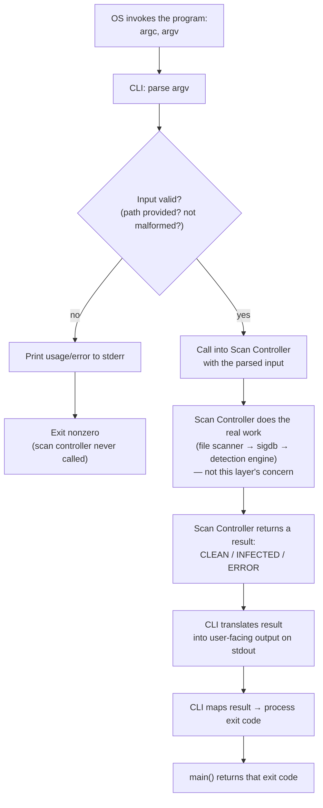

# CLI Skeleton

Status: **design draft** — no implementation yet. This document exists to reach agreement on the goal and shape of this layer before writing any code, per the project's "documentation before implementation" practice.

## Goal

`main()` currently takes no arguments and does no decision-making — it just prints a fixed banner and a few log lines. The MVP's first requirement is "accept a file path," which means something has to start parsing `argv`. The CLI skeleton is that something, and its goal is narrow and deliberate:

**Own the process's boundary with the outside world — argument parsing in, exit code out — and nothing about how a scan actually happens.**

Per the project's architecture (`CLI → Scan Controller → File Scanner → Signature Database → Detection Engine → Result`), the CLI sits above the Scan Controller, not inside it. Two different things could be called "orchestration" here, and this layer is only responsible for one of them:

- **The CLI orchestrates process plumbing:** turn `argv` into structured input, call into the scan controller, turn whatever comes back into user-visible output and a process exit code.
- **The Scan Controller orchestrates the actual work** (file scanner → signature database → detection engine → result) — a separate concern, one layer down, that this document is not about.

A concrete test for whether this boundary is drawn correctly: if the CLI were replaced entirely (say, a future daemon mode watching a directory instead of reading one path from `argv`), the Scan Controller shouldn't need to change at all — it should just get called the same way, by something else.

**Why this is worth its own layer instead of living in `main()`:**
- **Testability** — scan logic callable directly (no subprocess, no `argv` simulation) once it's behind a function boundary the CLI merely calls.
- **Growth without rework** — today it's one positional file path; soon it's plausibly `--verbose`/`--quiet` (tying into `sentinel_log_set_level`, already exposed for exactly this), maybe `--version`. Isolating parsing means adding a flag touches one place.
- **Exit codes are a real interface** — by Unix convention, `0` means clean/success and nonzero means infected or error; other tools and scripts branch on this. That mapping deserves to be deliberate, not incidental.
- **A stable seam for modules that don't exist yet** — the Scan Controller isn't built. This skeleton defines the shape of the call the CLI will make into that layer, so it can be built and slotted in independently.

## Ideal flow



The two branches out of the validity check (`C`) matter: invalid input should fail fast, on stderr, with a nonzero exit — and critically, it should never reach the Scan Controller at all. The CLI is responsible for catching malformed input before the "real" pipeline is ever invoked, not for the pipeline handling bad input itself.

## Input validation: shape vs. deep validation

Not everything that looks like "input validation" belongs to the CLI. Two different categories:

**Shape validation (the CLI's job — answerable from `argc`/`argv` alone, no filesystem access):**
- Valid: `sentinel /path/to/file` — exactly one argument, a path.
- Valid: `sentinel ./sample.exe` — relative path, same deal.
- Valid: `sentinel "/path/with spaces/file"` — the shell has already resolved quoting before `main` ever sees `argv`, so this arrives as one clean string; not the program's problem.
- Invalid: `sentinel` (no argument), `sentinel file1 file2` (too many — MVP scans one file), `sentinel ""` (empty string), `sentinel --unknown-flag` (nothing defines it).

**Deep validation (NOT the CLI's job — requires touching the filesystem):**
- A path that doesn't exist, a path that's a directory instead of a file, a path that exists but isn't readable (permission denied).

These are deliberately *not* checked by the CLI before calling the Scan Controller. Reasoning: they can also fail mid-scan for reasons unrelated to the initial check (a file deleted or re-permissioned between a pre-check and the actual open — a TOCTOU race), so the File Scanner has to handle "can't open this" robustly regardless. A CLI-side pre-check would be redundant and could still be stale by the time it matters. Instead, these surface as the Scan Controller's `ERROR` outcome (see below) — going through the normal result path, not a separate CLI-side error path.

## Scan Controller contract (v1)

Decided: the Scan Controller returns a **bare three-value outcome**, nothing richer for now:
```
SENTINEL_SCAN_CLEAN
SENTINEL_SCAN_INFECTED
SENTINEL_SCAN_ERROR
```
No accompanying detail string (e.g. matched signature name, or error reason) in this version — that's an intentional simplification, deferred until the Scan Controller actually exists and there's a real implementation to enhance. This mirrors an existing convention from real AV CLIs (e.g. `clamscan`'s exit codes: `0` no virus, `1` virus found, `2` error), which the CLI's exit-code mapping should follow: `CLEAN → 0`, `INFECTED → 1`, `ERROR → 2`.

This is a contract the CLI skeleton can be built and tested against today, even though the Scan Controller itself is only a stub — and it's expected to grow (e.g. an optional detail string) once that module is real, without changing the CLI's overall shape.

## Requirements

1. Accept exactly one command-line argument: the file path to scan.
2. Perform shape validation only (no filesystem access at this stage) and reject, without ever calling the Scan Controller:
   - zero arguments,
   - two or more arguments,
   - an empty-string argument,
   - an argument beginning with `-` — treated as an unrecognized option rather than a literal path. No flags exist in v1, but reserving `-`-prefixed syntax now avoids ambiguity later (e.g. someone typing a typo'd future flag getting a confusing "file not found" instead of "unknown option").
3. On any rejection, print a usage/error message to **stderr** and exit with a nonzero status — never stdout, since this is diagnostic, not the scan's result.
4. On valid input, call into the Scan Controller with the parsed path. Since the real Scan Controller doesn't exist yet, this requires only a minimal stub matching the agreed contract (takes a path, returns `SENTINEL_SCAN_CLEAN`/`INFECTED`/`ERROR`) — implementing actual scanning (file reading, signature comparison, detection logic) is explicitly out of scope for this work item; it belongs to the later "MVP scanner" roadmap item.
5. Translate the returned outcome into:
   - a one-line, outcome-appropriate message on **stdout** (the scan's actual result — clean, infected, or error), and
   - a process exit code: `CLEAN → 0`, `INFECTED → 1`, `ERROR → 2`.
6. Any diagnostic/log narration continues to go through the existing `sentinel_log_*` module on stderr, per the established separation — the CLI does not introduce a second logging convention.
7. No file I/O, signature handling, or detection logic exists in the CLI's own code — the only thing it does with the parsed path is pass it to the Scan Controller (stub or real).

## Acceptance criteria

- `sentinel` (no args) → usage/error on stderr, nothing on stdout, nonzero exit, Scan Controller never invoked.
- `sentinel a b` (two args) → same as above.
- `sentinel ""` (empty-string arg) → same as above.
- `sentinel --foo` (arg starting with `-`) → same as above — rejected as an unrecognized option, not passed through as a literal filename.
- `sentinel /some/path` (one well-formed argument) → the Scan Controller stub is invoked exactly once, with that exact path.
- The process exit code deterministically reflects the stub's outcome across all three cases (`CLEAN→0`, `INFECTED→1`, `ERROR→2`) — verifiable by temporarily varying what the stub returns and checking `$?` after each run.
- Each outcome produces a distinguishable one-line message on stdout, while stderr carries only log/diagnostic output (verifiable the same way as the logging module: redirect each stream separately and inspect).
- `make debug` and `make release` both build with zero warnings under the project's existing `-Wall -Wextra -Wpedantic -Werror -std=c17` flags.
- Code review confirms no scanning/file/signature logic lives in the CLI's source — only argument parsing, the Scan Controller call, and result-to-output/exit-code translation.

## Status

Goal, ideal flow, input-validation boundary, Scan Controller v1 contract, requirements, and acceptance criteria are all agreed. Ready to move to implementation planning.
