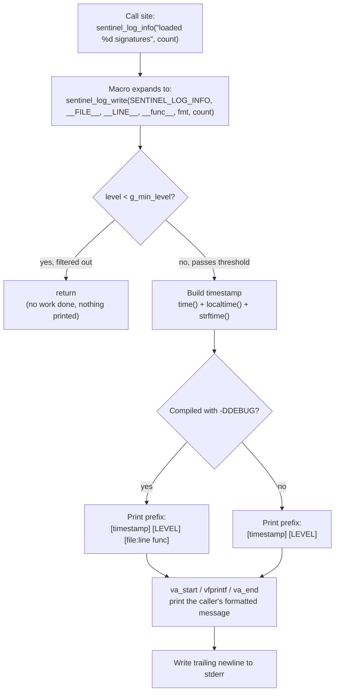

# Logging Module

`include/sentinel_log.h` / `src/sentinel_log.c`

## Purpose

Sentinel is going to grow several modules — a CLI, a scan controller, a signature database, a detection engine — and every one of them will eventually need to report what it's doing: "loaded 42 signatures," "failed to open /path/to/file," "scan complete, 1 match found." Without a shared facility, each module invents its own `fprintf(stderr, ...)` convention, and diagnostics end up inconsistent in format, severity, and verbosity from one module to the next.

The logging module exists to be the one obvious way to report that kind of information, so that:

- **Severity is explicit.** A `DEBUG`/`INFO`/`WARN`/`ERROR` level is attached to every message, so output can be filtered by how serious it is rather than all-or-nothing.
- **Diagnostics stay off the program's real output.** Log lines go to `stderr`. Actual program output (today, just the version banner; later, scan results) stays on `stdout`. This means `sentinel file.txt > result.txt` captures the real result without diagnostic noise polluting it.
- **Debug builds are self-locating.** Compiled with `-DDEBUG` (the project's debug build flag), every log line reports exactly which file, line, and function it came from — no more grepping the codebase for a message string after a crash.
- **Format-string bugs are caught at compile time.** Every log call is checked by the compiler exactly like a `printf` call would be, so passing an `int` where a `%s` is expected fails the build instead of corrupting output at runtime.

## Flow

Every log call funnels through the same path, whether it's `sentinel_log_debug(...)`, `sentinel_log_info(...)`, `sentinel_log_warn(...)`, or `sentinel_log_error(...)`:



The key branch point is the filter check at the very top (`C`): a message below the current threshold does zero work beyond a single integer comparison — no timestamp is built, nothing is formatted, nothing is written. The second branch point (`F`) is decided at **compile time**, not runtime — it's a `#ifdef DEBUG`, so a release binary doesn't even contain the code path that prints file/line/function.

## Anatomy

**Files**
| File | Role |
|---|---|
| `include/sentinel_log.h` | Public API: the level type, function declarations, convenience macros. What other modules `#include`. |
| `src/sentinel_log.c` | Implementation: state, formatting, filtering logic. |

**The level type**
```c
typedef enum sentinel_log_level {
    SENTINEL_LOG_DEBUG = 0,
    SENTINEL_LOG_INFO,
    SENTINEL_LOG_WARN,
    SENTINEL_LOG_ERROR
} sentinel_log_level_t;
```
The numeric ordering (`DEBUG` < `INFO` < `WARN` < `ERROR`) is load-bearing, not decorative — it's what makes the filter check (`level < g_min_level`) work as "show this severity and anything more severe."

**Public API** (declared in the header)
| Symbol | Kind | Purpose |
|---|---|---|
| `sentinel_log_set_level(level)` | function | Sets the minimum severity that gets printed. |
| `sentinel_log_get_level()` | function | Reads the current minimum severity. |
| `sentinel_log_write(level, file, line, func, fmt, ...)` | function | The single real implementation. Public so a future caller can log at a level chosen at runtime, but normally reached only through the macros below. |
| `sentinel_log_debug(...)` / `_info` / `_warn` / `_error` | macros | What call sites actually use. Each forwards to `sentinel_log_write`, injecting the matching level plus `__FILE__`, `__LINE__`, `__func__` captured at the *call site*. |

**Internal state and helper** (private to `sentinel_log.c`, not exposed in the header)
| Symbol | Kind | Purpose |
|---|---|---|
| `g_min_level` | `static` file-scope variable | The only mutable state in the module. Defaults to `SENTINEL_LOG_DEBUG` in debug builds, `SENTINEL_LOG_INFO` in release. Reachable only through `sentinel_log_set_level`/`get_level` — nothing outside this file can touch it directly. |
| `level_name(level)` | `static` function | Maps a level to its display string (`"DEBUG"`, `"INFO"`, ...) via a small array indexed by the enum value. |

**Why the `SENTINEL_LOG_*` / `sentinel_log_*` prefix everywhere:** `<syslog.h>` on macOS/POSIX defines bare macros `LOG_DEBUG`, `LOG_INFO`, `LOG_WARNING`, `LOG_ERR`, etc. Anything in this module that used an unprefixed name would be a landmine for any future file that also includes `<syslog.h>` (e.g. for real syslog integration). Prefixing everything — types, constants, functions — makes this module's identifiers collision-proof project-wide, and establishes the pattern later modules (`sentinel_scan_*`, `sentinel_sigdb_*`, ...) are expected to follow.

## How it works — a worked example

Say `main.c` (compiled as part of the debug build) calls:
```c
sentinel_log_error("failed to open %s", path);
```

1. **Macro expansion** (preprocessor, before compilation): this line is textually replaced with
   ```c
   sentinel_log_write(SENTINEL_LOG_ERROR, __FILE__, __LINE__, __func__, "failed to open %s", path);
   ```
   `__FILE__`, `__LINE__`, and `__func__` are resolved *here*, at the real call site — which is the entire reason this has to be a macro rather than a plain wrapper function. A function's `__FILE__`/`__LINE__` would always point at `sentinel_log.c` itself, not wherever it was actually called from.

2. **The filter check:** `SENTINEL_LOG_ERROR` (3) is compared against `g_min_level`. Even in a release build defaulting to `SENTINEL_LOG_INFO` (1), `ERROR` clears the bar, so execution continues. (Contrast with `sentinel_log_debug("...")` in a release build: `DEBUG` (0) `< INFO` (1) is true, so it returns immediately and nothing is printed.)

3. **Timestamp:** `time(NULL)` gets the current time, `localtime()` breaks it into local-time fields, `strftime` formats it as `"%Y-%m-%d %H:%M:%S"` into a 20-byte buffer (19 characters for that exact format plus a null terminator — sized to the known worst case, not rounded up arbitrarily).

4. **Prefix, branching on build type:**
   - Debug build: `[2026-08-03 00:34:37] [ERROR] [src/main.c:12 main] `
   - Release build: `[2026-08-03 00:34:37] [ERROR] `

5. **The message itself:** `va_start(args, fmt)` opens a handle onto whatever was passed after `fmt` (just `path`, here). `vfprintf(stderr, fmt, args)` is the `va_list`-accepting sibling of `fprintf` — it does the actual `%s` substitution, writing `failed to open /some/path` right after the prefix. `va_end(args)` closes out the handle, as the standard requires.

6. **Newline:** a trailing `\n` is written so the next log line starts cleanly.

Final debug-build output: `[2026-08-03 00:34:37] [ERROR] [src/main.c:12 main] failed to open /some/path`

### Adjusting verbosity at runtime

`sentinel_log_set_level(SENTINEL_LOG_WARN)` raises the bar so only `WARN` and `ERROR` print, regardless of build type. Nothing calls this yet — it's exposed now so the CLI skeleton (the next roadmap item) can wire a future `--verbose`/`--quiet` flag to it without needing an API change later.

### Explicit non-goals for this version

- **No file output** — everything goes to `stderr`. Redirecting logs to a file is a future config-module concern.
- **No thread safety** — `g_min_level` and `localtime()`'s internal buffer are both touched without locking. Fine today because the whole codebase is single-threaded; would need revisiting if a multithreaded scan controller ever calls into this concurrently.
- **No structured/JSON output** — plain text only, matching v1's scope.
