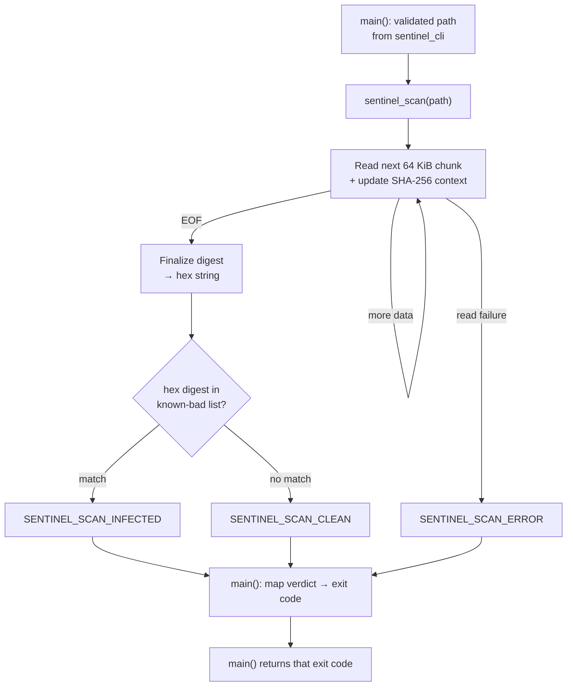

# Scan Controller

Status: **implemented (v1)** — this document captures the intended contract and rationale for the current Scan Controller implementation.

## Goal

Before this module was implemented, `main()` validated that its one argument was a real, readable file and then exited. The Scan Controller turns that validated path into an actual antivirus function.

It also fills the seam [`cli-skeleton.md`](cli-skeleton.md) deliberately left open: that document defines the CLI's contract with this layer (a path in, a `SENTINEL_SCAN_CLEAN`/`INFECTED`/`ERROR` outcome out) and stubs the call, but explicitly puts "implementing actual scanning" out of its own scope. This document is that later item.

Whole-file hash matching against a known-bad list is the first detection method because it's the cheapest to build and the easiest to prove correct: seed the list with the EICAR test file's SHA-256, run `sentinel` against that file, and the pipeline either reports `INFECTED` or it's broken. No malware corpus, no signature format, no heuristics tuning — just read, hash, compare. Later detection methods (byte-pattern signatures, heuristics) are expected to live behind this same module boundary, so `main.c` and `sentinel_cli.c` never need to change to accommodate them — they only ever see a verdict come back.

## Ideal flow



Reading the file in fixed-size chunks rather than loading it whole is the one implementation detail worth calling out in the flow itself: it's what keeps scan memory use from scaling with file size, and it's naturally compatible with how a streaming hash function works — each chunk folds into the running digest, nothing needs to sit in memory as a whole file.

## Scan Controller contract (v1)

Already decided in [`cli-skeleton.md`](cli-skeleton.md#scan-controller-contract-v1) — not reopened here:

```
SENTINEL_SCAN_CLEAN
SENTINEL_SCAN_INFECTED
SENTINEL_SCAN_ERROR
```

mapped by `main` to exit codes `CLEAN → 0`, `INFECTED → 1`, `ERROR → 2`. This module is what makes that contract real instead of a stub — same three-value outcome, no accompanying detail string in this version (no matched-signature name, no error reason), matching the CLI doc's existing simplification.

## Requirements

**Functional**
1. Accept a single path already validated by `sentinel_cli_validate_path` — the controller can assume it exists and is a regular file, and doesn't re-check either.
2. Read the file in fixed-size chunks (64 KiB) rather than loading it whole.
3. Compute a SHA-256 digest over the full file content as those chunks stream through.
4. Compare the hex-encoded digest against a static, in-memory list of known-malicious hashes.
5. Return exactly one of `SENTINEL_SCAN_CLEAN` / `SENTINEL_SCAN_INFECTED` / `SENTINEL_SCAN_ERROR` — as a return value, not as printed output from inside the controller. Printing and exit-code mapping stay `main`'s job, per the CLI skeleton's existing stdout/stderr split.
6. Seed the known-bad list with at least the EICAR test file's SHA-256, so the whole pipeline is provable without a real malware sample.

**Non-functional**
- Builds clean on both targets this project already supports — no platform-specific detection logic inside the controller itself.
- No new third-party dependencies beyond whatever the hash implementation needs; if that turns out to be a platform crypto API, it stays behind this module's interface.
- Detection logic stays isolated in `sentinel_scan.c` — `main.c` and `sentinel_cli.c` know only that they get a verdict back, never how it was reached.

**Out of scope for this step**
- Directory or recursive scanning — `sentinel_cli_validate_path` already rejects anything that isn't a regular file.
- Byte-pattern signature scanning, heuristics, or any behavioral detection.
- On-access or background scanning — this is on-demand, one file per invocation.

## Acceptance criteria

- Running against the EICAR test file returns `SENTINEL_SCAN_INFECTED`.
- Running against an arbitrary clean file returns `SENTINEL_SCAN_CLEAN`.
- Simulating a read failure mid-scan (e.g. a file that becomes unreadable after `sentinel_cli_validate_path` already passed it — a TOCTOU case the CLI doc already anticipates) returns `SENTINEL_SCAN_ERROR`, not a crash.
- Memory use during a scan does not scale with input file size (verifiable by scanning a multi-gigabyte file without a proportional memory spike).
- The controller itself never writes to stdout/stderr — verifiable by capturing both streams around a direct call and confirming they're empty regardless of verdict.
- `make debug` and `make release` both build with zero warnings under the project's existing `-Wall -Wextra -Wpedantic -Werror -std=c17` flags.

## Open decisions

- **Where does the known-bad list live?** A hardcoded array is enough to prove the pipeline (requirement 6 above), but it doesn't answer where a real list comes from later — a bundled file, a fetched feed, something else.
- **Does the controller ever call the logging module?** Nothing in these requirements calls for it yet — there's no internal state complex enough to be worth tracing. Worth revisiting once there's more than one code path inside the controller.

## Status

Goal, ideal flow, and the scan controller contract are settled (the contract was actually agreed earlier, in the CLI skeleton doc). The hashing approach is also settled — see [`sha256-hashing.md`](sha256-hashing.md): a self-contained, verified SHA-256 implementation, not a platform crypto API. Two open decisions remain above — neither blocking enough to stall the first implementation pass, but worth resolving before the known-bad list gets load-bearing.
