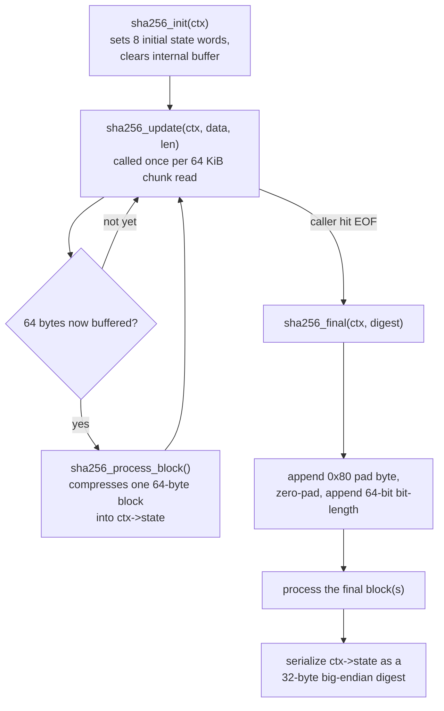

# SHA-256 Hashing

`include/sha256.h` / `src/sha256.c`

## Purpose

The scan controller's first detection method (see [`scan-controller.md`](scan-controller.md)) needs to turn a file's contents into a fixed-size fingerprint it can compare against a list of known-malicious hashes. This module is that fingerprint function: a self-contained implementation of SHA-256 (FIPS 180-4), with no dependency on any OS-provided crypto library.

This resolves the "where does SHA-256 come from" question the scan controller doc left open. The alternative was platform crypto APIs — BCrypt on Windows, CommonCrypto on macOS — which would have meant two implementations behind an `#ifdef`, in the same style as the `fopen`/`fopen_s` and `localtime_r`/`localtime_s` splits elsewhere in this codebase. A self-contained version was chosen instead: one code path, identical behavior on both platforms, pure C17 with no OS headers.

## Streaming design

Per the scan controller's design, a file is read in fixed 64 KiB chunks rather than loaded whole, so scan memory doesn't scale with file size. That means the hash function has to accept data incrementally instead of needing the whole file up front — which is exactly what SHA-256 already does internally: it processes a message in fixed 64-*byte* blocks regardless of how the caller hands data over. This module exposes that as three calls — `init` / `update` / `final` — matching the shape of every streaming hash API (this is also the same shape `BCryptCreateHash` / `BCryptHashData` / `BCryptFinishHash` would have used, had the platform-API route been picked instead).

`update` can be called any number of times, with any chunk sizes — one call with the whole file, or one call per byte — and produces an identical digest either way. That's verified directly (see below), not just assumed.

## Anatomy

**Files**
| File | Role |
|---|---|
| `include/sha256.h` | Public API: the `sha256_ctx` state struct and three functions. What other modules `#include`. |
| `src/sha256.c` | Implementation: round-constant table, block compression, padding/finalization. |

**Public API** (declared in the header)
| Symbol | Kind | Purpose |
|---|---|---|
| `sha256_init(ctx)` | function | Resets `ctx` to the FIPS-180-4 initial hash values. Call once before any data is fed in. |
| `sha256_update(ctx, data, len)` | function | Folds `len` bytes into the running hash. Safe to call repeatedly with arbitrary chunk sizes. |
| `sha256_final(ctx, digest)` | function | Applies padding, processes the final block(s), and writes the 32-byte digest. `ctx` shouldn't be reused afterward without calling `sha256_init` again. |

**Internal** (private to `sha256.c`, not exposed in the header)
| Symbol | Kind | Purpose |
|---|---|---|
| `K[64]` | `static const` array | The 64 round constants (first 32 bits of the fractional cube roots of the first 64 primes) — fixed by the standard, not tunable. |
| `rotr(x, n)` | `static` function | Right-rotate helper used throughout the compression function. |
| `sha256_process_block(ctx, block)` | `static` function | The actual compression function — transforms `ctx->state` using exactly one 64-byte block. Everything in `update`/`final` exists to assemble correctly-sized blocks and hand them to this. |

## Worked example

Hashing the 3-byte message `"abc"` (`0x61 0x62 0x63`):

1. `sha256_update` buffers the 3 bytes. `ctx->buffer_len` is `3` — nowhere near the 64-byte threshold, so `sha256_process_block` hasn't run yet.
2. `sha256_final` appends the required `0x80` pad byte (`buffer_len` → `4`), then appends `0x00` bytes one at a time until `buffer_len` reaches `56` — the standard reserves the last 8 bytes of the final block for the message's bit-length.
3. The original bit-length (`3 bytes × 8 = 24 bits`) is written as an 8-byte big-endian value (`0x0000000000000018`) into `buffer[56..63]`.
4. That single, now-complete 64-byte block is compressed via `sha256_process_block`.
5. The 8 words of `ctx->state` are serialized big-endian into the 32-byte digest: `ba7816bf8f01cfea414140de5dae2223b00361a396177a9cb410ff61f20015ad`.

A longer message that doesn't fit the padding into one block (anything ≥ 56 bytes into its final block) follows the same steps, except the pad byte and zero-fill roll over into a second block before the length is appended — `sha256_update`'s block-boundary logic handles that transition the same way it handles any other 64-byte boundary.

## Verification

This was checked against published test vectors rather than trusted by construction — hand-transcribing the round-constant table is exactly the kind of place a single wrong hex digit would silently produce a plausible-looking but wrong hash.

| Input | Expected digest (SHA-256) | Result |
|---|---|---|
| `""` (empty) | `e3b0c44298fc1c149afbf4c8996fb92427ae41e4649b934ca495991b7852b855` | matches |
| `"abc"` | `ba7816bf8f01cfea414140de5dae2223b00361a396177a9cb410ff61f20015ad` | matches |
| NIST two-block vector (`"abcdbcdecdefdefg..."`, 56 bytes) | `248d6a61d20638b8e5c026930c3e6039a33ce45964ff2167f6ecedd419db06c1` | matches |
| Same two-block vector, fed one byte at a time across many `sha256_update` calls | same digest as above | matches |

The two-block vector exercises the multi-block compression and the pad-byte-rolls-into-a-new-block case; the byte-at-a-time run exercises the streaming/buffering path exactly as it'll actually be called from a chunked `fread` loop, not just the single-call case.

## Explicit non-goals for this version

- **Not constant-time.** No hardening against timing side-channels. This hashes file contents for a blocklist comparison, not secrets — if a future feature ever hashes something sensitive (a password, a key), don't reach for this implementation as-is.
- **No hardware acceleration.** This is a straightforward reference implementation, not tuned with SHA-NI intrinsics or similar. Worth revisiting only if scan throughput on large files becomes a measured bottleneck, not preemptively.
- **No persisted/resumable state.** `sha256_ctx` is meant to live for the duration of one scan call; it isn't designed to be serialized and resumed across process runs.
